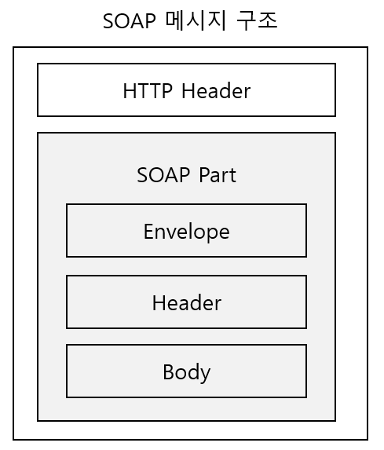
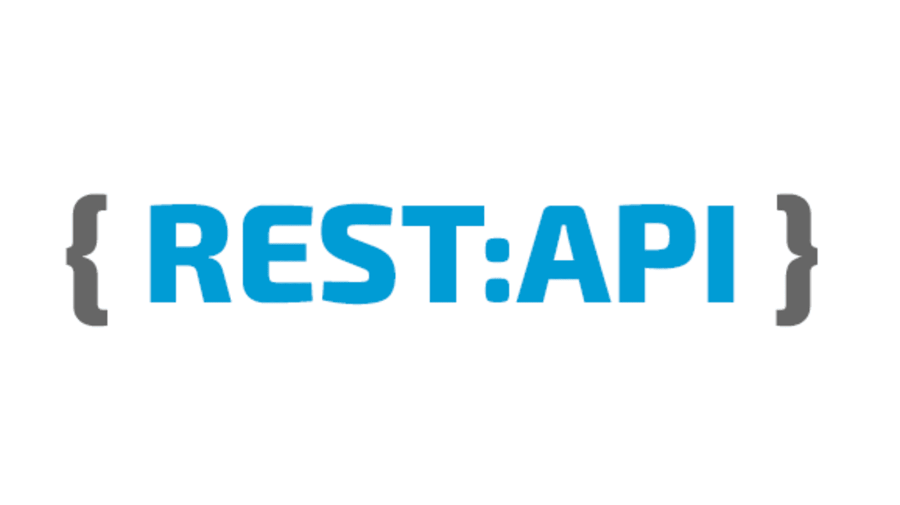
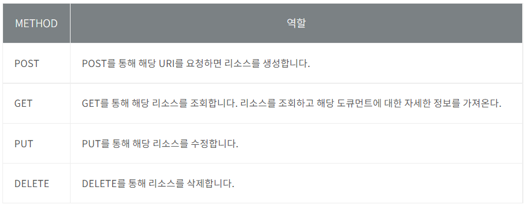

# Intro

웹 애플리케이션 간의 통신을 담당하는 API 의 구조를 이야기할 때, 가장 대표적인 두 가지 방식으로 SOAP API 와 REST API 가 있다. 두 가지의 차이점을 알아보는 것이 목표 !

</br>

## 배경 지식

### API ( Application Programming Interface )

소프트웨어가 다른 소프트웨어로부터 __지정된 형식으로 요청, 명령을 받을 수 있는 수단__  
예를 들어, 윈도우에는 개발자들이 프로그램을 개발할 때 시스템이나 하드웨어에 대한 세세한 지식 없이도 지정된 명령어로 윈도우에서 동작을 수행하도록 소프트웨어를 짤 수 있는 Windows API 를 제공한다.

</br>

### XML ( eXtensible Markup Language )

번역하면 '확장성 생성 언어'로, 웹페이지를 만드는 HTML 을 획기적으로 개선하여 만든 언어. 그러나 HTML 처럼 데이터를 보여주는 목적이 아닌, 데이터를 저장하고 전달할 목적으로만 만들어졌다.  

- 역사  
XML 은 __웹 문서를 구조화하는 사실상의 표준 형식__ 으로 1996년 W3C가 제안하였고, 1998년 2월 차세대 인터넷 표준언어로 XML 1.0표준을 발표하고 권장 규격으로 채택하였다.  

<div align="center"></div>

가장 먼저 나온 마크업 언어인 SGML(Standard Generalized Markup Language ) 은 1969 년 미국 IBM 이 사내 주요 문서 교환 및 관리를 쉽게 하기 위해 만든 것으로 1986년 ISO 표준으로 제정되었다.  
SGML은 특정 문서를 정의하는 데 필요한 태그를 임의로 생성하여 문서 구조를 정의할 수 있으나, __너무 복잡하여 활용하기 어렵고 이를 지원하는 소프트웨어를 개발하기가 어렵다__ 라는 문제점이 있다.  

</br>

<div align="center"></div>

단순하고 쉬워서 널리 사용되는 HTML(Hyper-Text Markup Language)은 웹 브라우저에 웹 문서의 각 부분이 보여질 형식, 특히 하이퍼링크를 표시하는 데 사용된다. 단순하고 사용이 용이하다는 큰 장점이 있지만, 제한된 몇 개의 태그만을 가짐으로써 특수 문자나 기호 등 복잡한 기능을 수행하지 못하는 단점이 있다. 즉, __HTML 태그는 문자의 크기나 색깔 등 표현방식에 치중되어 있고, 문서의 구조 정보를 표현하기 어렵다.__  
HTML 의 단점을 극복하기 위해 여러 가지 스크립트 언어와 DHTML(Dynamic HTML), Channel 등의 우회적인 방법이 존재하지만 브라우저 간의 호환성 부재라는 심각한 문제가 있다.

</br>

<div align="center"></div>

XML은 SGML 의 하위셋이라고 볼 수 있다.  

``` 인터넷 환경에 적합하도록 간결성, 보편성, 활용성에 중점을 두고 설계되었으며, 디자인에만 제한된 HTML 과는 달리 독자적인 애플리케이션, 즉 RDF(Resource Description Format)을 갖는다. ```

</br>

정리하자면 __XML 은 HTML 과 SGML 의 장점을 모두 살려 표준화 작업이 이루어진 웹 페이지 기술 언어__ 이다.

<hr/>

### SOAP 와 REST

SOAP 와 REST 는 각기 다른 두 가지의 온라인 데이터 전송 방식이다. 둘 다 웹 애플리케이션 간 데이터 통신을 허용하는 API 를 구축하는 방법을 정의한다. __가장 큰 차이점은 REST 는 아키텍처 스타일이고 SOAP 는 W3C(World Wide Web Consortium)에서 유지관리하는 공식 프로토콜__ 이다. 일반적으로 사용 시 활용 사례와 개발자의 선호에 고려하여 둘 중 하나를 준수한다.

## SOAP

Simple Object Access Protocol 의 약자  
일반적으로 널리 알려진 HTTP, HTTPS, SMTP 등을 통해 __XML 기반의 메시지__ 를 컴퓨터 네트워크 상에서 교환하는 프로토콜로써 API를 제공하는 데 사용된다.  

SOAP 메시지 구조는 다음과 같다.
<div align="center"></div>

1) Envelope  
   SOAP 메시지 루트(봉투)로써, Header(옵션) 와 Body(필수)를 포함하고 있다.
2) Header
   선택적 요소로 메시지 경로를 제공하여 처리된 애플리케이션 관련 정보를 전달하는데 사용된다.
3) Body
   필수적 요소로 주요 정보를 가지고 있는 부분.

### SOAP 의 장단점

1) 장점
   - 플랫폼과 프로그래밍 언어에 독립적으로 사용됨
   - 간단하고 확장이 용이함
   - 방화벽에 제한을 받지 않음
   - W3C 표준으로 개발됨
   - 보안이 우수함
2) 단점
   - 하나의 메시지가 Envelope, Header, Body 로 구성된 하나의 XML 문서로 표현됨
     - 이러한 복잡한 구성으로 인해 HTTP 상에서 전달되기 무거움
     - 메시지 인코딩/디코딩 과정 등 웹 서비스 개발 난이도가 높아 개발 환경의 지원이 필요함
     - RESTful API 에 비하여 느림

</br>

## REST

REST : Representational State Transfer 의 약자  

Web 같은 분산 하이퍼미디어 시스템을 위한 소프트웨어 아키텍처의 한 형식. REST 의 원리를 따르는 시스템을 RESTful 이란 용어로 지칭한다. 위에서 말했듯이 REST 는 프로토콜이나 표준이 아닌 아키텍처 스타일이다.  
__자원(Resource)을 자원의 표현(Representation)으로 구분하여 해당 자원의 상태(State) 혹은 정보를 주고 받는 모든 것을 의미한다.__  
여기서 자원(리소스)란 REST 아키텍처의 핵심 요소로서 웹 사이트, 블로그, 이미지, 음악, 검색 결과 등 ```웹에서 다른 이들과 공유하고자 개방된 모든 자원을 의미한다. REST 구조에서 자원은 고유한 URI를 가지며, HTTP 기본 메소드인 GET/PUT/POST/DELETE 만으로 접근할 수 있다```.

```REST API``` 를 통해 요청이 수행될 때 ```REST API``` 는 리소스 상태에 대한 표현을 요청자에게 전송한다. 이 정보 또는 표현은 ```HTTP : JSON(Javascript Object Notation), HTML, XLT``` 또는 일반 텍스트를 통해 몇 가지 형식으로 전송된다.  ```JSON```은 그 이름에도 불구하고 사용 언어와 상관이 없으며 사람과 컴퓨터 모두 읽을 수 있기 때문에 가장 널리 사용된다.

</br>

<div align="center"></div>

<div align="center"></div>

<div align="right"><span style="font-size:50%">이미지 출처 : https://phpenthusiast.com/blog/what-is-rest-api</span></div>

### REST 구성

- 자원(Resource) - URI
  - 모든 자원에 고유한 ID(URI)가 존재하고, 이 자원은 서버에 존재한다.
  - Client 는 URI 를 이용해서 자원을 지정하고 해당 자원의 상태(정보)에 대한 조작을 서버에 요청한다.
- 행위(Verb) - HTTP Methods
  - HTTP 프로토콜은 GET, POST, PUT, DELETE 와 같은 메서드를 제공한다.
- 표현(Representations)
  - 클라이언트가 자원의 상태(정보)에 대한 조작을 요청하면, 서버는 이에 적절한 응답(Representation)을 보낸다.
  - REST 에서 하나의 자원은 JSON, XML, TEXT, RSS 등 여러 형태의 Representation 으로 나타내어 질 수 있다.
  - 일반적으로 JSON 혹은 XML 을 통해 데이터를 주고 받는다.

</br>

### REST 의 특징

1. Server - Client ( 서버 - 클라이언트 ) 구조
    - 자원을 요청하고 받아서 처리하는 쪽이 명확하게 구분되어 있다
      - Server : API 제공 및 비즈니스 로직 처리와 저장
      - Client : 사용자 인증과 세션, 로그인 정보 등을 관리
2. Stateless ( 무상태 )
    - 무상태 : 작업을 위한 상태정보를 따로 저장하고 관리하지 않음
    - HTTP 프로토콜은 무상태성 프로토콜이므로 REST 역시 동일하다.
    - Server 에서 Client 의 세션과 쿠키 같은 Context 정보를 신경쓰지 않아도 되므로 API 서버는 들어오는 요청만을 단순히 처리하면 된다.
    - 따라서, 이전 요청이 다음 요청의 처리에 연관성을 가지지 않는다. 이것은 Server 의 처리 방식에 일관성을 부여하고 서비스의 자유도를 높여주며, 불필요한 정보를 관리하지 않음으로써 구현이 단순해진다.
3. Cacheable ( 캐시 처리 가능 )
    - HTTP 프로토콜은 캐시 기능을 제공한다.
    - REST 는 HTTP 를 그대로 사용하므로 웹에서 사용하는 기존의 인프라를 그대로 활용할 수 있다
    - 캐시 사용을 통해 빠른 응답 시간과 REST Server 의 트랙잭션이 발생하지 않기 때문에 전체적인 성능을 향상시킬 수 있다.
    - HTTP 프로토콜에서 Last-Modified 태그나 E-Tag 를 이용하여 캐싱 구현이 가능
4. Layered System ( 계층화 )
    - REST 서버는 다중 계층으로 구성될 수 있다.
    - 보안, 로드 밸런싱, 암호화 계층을 추가하여 구조상의 유연성을 둘 수 있다
    - Proxy, Gateway 같은 네트워크 기반의 중간 매채를 쓸 수 있다.
5. Uniform Interface ( 인터페이스 일관성 )
    - URI 로 지정한 리소스에 대한 조작을 통일되고 한정적인 인터페이스로 수행한다.
    - 이를 통해, 특정 언어나 기술에 종속되지 않고 HTTP 표준 프로토콜을 따르는 모든 플랫폼에서 사용 가능하다.
6. Self-Descriptiveness ( 자체 표현 구조 )
    - REST API 메시지만 보고도 이를 쉽게 이해할 수 있도록 자체 표현 구조로 되어 있다.

### REST API 디자인 가이드

#### 4.1 REST API 핵심 규칙

REST API 설계의 가장 중요한 두 가지는 다음과 같다.

1. URI 는 정보의 자원을 표현해야 한다. ( 리소스명은 동사보다는 명사를 사용 )
    ```
    GET /boards/delete/1
    ```
    - 위의 코드는 REST 가 제대로 적용하지 않은 URI 다.
    - URI 는 자원을 표현하는데 중점을 두어야 하며, delete 와 같은 행위에 대한 표현이 들어가서는 안된다.
2. 자원에 대한 행위는 HTTP Method(GET, POST, PUT, DELETE)로 표현한다
    - 위의 잘못된 URI 를 HTTP Method 를 수정해보면 다음과 같다.
    ```
    DELETE /boards/1
    ```
    - 추가적으로 몇가지 예시를 들어보면 다음과 같이 사용할 수 있다.  
    - 회원정보를 가져오는 URI
    ```
    GET /boards/show/1      ( X )  
    GET /boards/1           ( O )
    ```
    - 회원을 추가할 때
    ```
    GET /boards/create/2      ( X ) -> GET 메스드는 리소스 생성에 맞지 않다.
    POST /boards/2            ( O )
    ```

* 참고 : HTTP Method 의 알맞은 역할
  <div align="center"></div>

#### 4.2 URI 설계 시 주의사항 ( 규칙 )

1) 슬래시 구분자(/) 는 계층 관계를 나타내는데 사용한다.

```
http://restapi.example.com/index
```

2) URI 마지막 문자로 슬래시(/)를 포함하지 않는다.

URI 에 포함되는 모든 글자는 리소스의 유일한 식별자로 사용되어야 하며 URI가 다르다는 것은 리소스가 다르다는 의미이다. 역으로 리소스가 다르면 URI도 달라야 한다.  
REST API 는 명확한 URI 를 만들어 통신을 해야하므로 URI 경로 마지막에는 슬래스(/)를 사용하지 않는다.

```
http://restapi.example.com/index/   (X)
http://restapi.example.com/index    (O)
```

3) 하이픈(-)은 URI 가독성을 높이는 데 사용

불가피하게 긴 URI 경로를 사용할 때 하이픈을 사용해 가독성을 높일 수 있다.

4) 밑줄(_)은 URI 에 사용하지 않는다

글꼴레 따라 다르지만, 밑줄은 보기 어렵거나 문자가 가려지기도 한다. 가독성을 위해 하이픈(-) 을 사용한다.

5) URI 경로에는 소문자가 적합하다.

RFC3986(URI 문법 형식)은 URI 스키마와 호스트를 제외하고는 대소문자를 구별하도록 규정하기 때문에, 대소문자에 따라 다른 리소스로 인식된다.

6) 파일 확장자는 URI 에 포함시키지 않는다.

REST API 에서 메시지 바디 내용의 포맷을 나타내기 위한 파일 확장자를 URI 에 포함시키지 않는다.  
Accept header 를 사용하여 표현한다.
* 참고 : Accept 헤더는 브라우저에서 서버로 요청 시 요청 메시지에 담기는 헤더로 자신에게 특정 데이터 타입만 허용하겠다는 의미
```
http://restapi.example.com/boards/1/photo.jpg   ( X )
http://restapi.example.com/boards/1/photo HTTP/1.1 Host: restapi.example.com Accept: image/jpg    ( O )
```

7) 리소스 간에 연관 관계를 표현하는 방법

리소스간의 관계를 다음과 같은 표현방법을 사용한다.
```
/리소스명/리소스 ID/관계가 있는 다른 리소스명
GET : /users/{userID}/devices
```
위의 예시는 user 가 devices 를 소유(has) 한 관계이다. 좀 더 복잡한 관계는 서브 리소스에 명시적으로 표현할 수 있다.  
예를 들어 사용자가 좋아하는 디바이스 목록을 표현하는 경우 다음과 같은 형태로 사용될 수 있다.
```
GET : /users/{userID}/likes/devices
```
위의 방법은 관계명이 애매하거나 구체적 표현이 필요할 때 사용한다.

</br>

## 결론

한 마디로 정리하면,  
```웹 애플리케이션 간 데이터 통신을 하는 API 구축 시에 웹의 장점을 최대한 활용할 수 있게 하는 아키텍처```  
```핵심 규칙으로 URI 가 자원을 명확히 표시해야 하며 자원에 대한 행위는 HTTP Methods(GET, POST, PUT, DELETE) 로 표현한다.```  
[그런 REST API로 괜찮은가](https://www.youtube.com/watch?v=RP_f5dMoHFc) 혹은 [당신의 API가 Restful 하지 않은 5가지 증거](https://beyondj2ee.wordpress.com/2013/03/21/%EB%8B%B9%EC%8B%A0%EC%9D%98-api%EA%B0%80-restful-%ED%95%98%EC%A7%80-%EC%95%8A%EC%9D%80-5%EA%B0%80%EC%A7%80-%EC%A6%9D%EA%B1%B0/) 를 참고하면 RESTful 한 API 를 개발하는 것은 쉽지 않은 것 같다. 개발을 하며 계속 공부해야 하는 영역 중 하나라고 생각한다.

</br>

## 참조

[REST API가 뭔가요?](https://www.youtube.com/watch?v=iOueE9AXDQQ)  

[REST란? REST API란? RESTful이란?](https://gmlwjd9405.github.io/2018/09/21/rest-and-restful.html)

[http 메소드와 상태코드](https://kyun2da.dev/CS/http-%EB%A9%94%EC%86%8C%EB%93%9C%EC%99%80-%EC%83%81%ED%83%9C%EC%BD%94%EB%93%9C/)

[RedHat - REST와 SOAP 비교](https://www.redhat.com/ko/topics/integration/whats-the-difference-between-soap-rest)

[SOAP? REST? REST API? 무엇인가? :: 마이구미](https://mygumi.tistory.com/55)

[XML이란 무엇인가?](https://m.blog.naver.com/ycpiglet/222106807034)

[REST API 제대로 알고 사용하기](https://meetup.toast.com/posts/92)

[그런 REST API로 괜찮은가](https://www.youtube.com/watch?v=RP_f5dMoHFc)

[당신의 API가 Restful 하지 않은 5가지 증거](https://beyondj2ee.wordpress.com/2013/03/21/%EB%8B%B9%EC%8B%A0%EC%9D%98-api%EA%B0%80-restful-%ED%95%98%EC%A7%80-%EC%95%8A%EC%9D%80-5%EA%B0%80%EC%A7%80-%EC%A6%9D%EA%B1%B0/)
